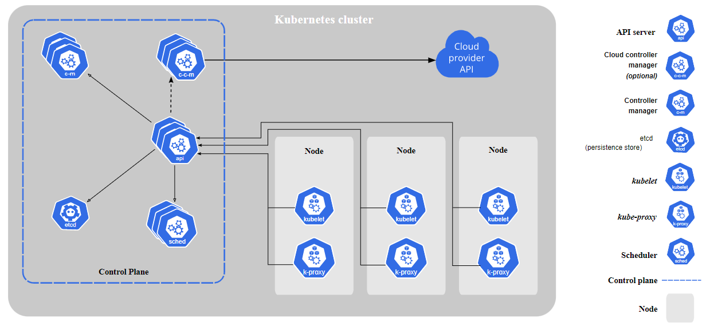

# kubernetes-ftw

*The purpose of this **unfinished** repository is to document my Kubernetes journey, and nerd-out!*

## To Do:

## Learning Material:
- [x] [Docker Certified Associate (A Cloud Guru)](https://learn.acloud.guru/course/6b00566d-6246-4ebe-8257-f98f989321cf/overview)
- [x] [Learn Kubernetes by Doing (A Cloud Guru)](https://learn.acloud.guru/course/82b39fac-b9f7-43d1-8f52-6a89efe5202f/dashboard)
- [ ] [Certified Kubernetes Administrator (CKA) with Practice Tests (Udemy)](https://www.udemy.com/course/certified-kubernetes-administrator-with-practice-tests/)

## Lessons Learned:
- I completed the ACG Docker course to prepare me for diving into Kubernetes
- The Udemy course was hard to follow when I had zero hands-on experience
- After a few videos in, I pivoted to the ACG Learn Kubernetes by Doing course to get my hands dirty
- This was a great move!
- The Udemy course is a GREAT resource

## Useful commands:
- `kubectl get pods` [List pods in default namespace]
- `kubectl get pods -o wide` [List more details]
- `kubectl run --help` [Help file]
- `kubectl run nginx --image=nginx` [Create pod]
- `kubectl describe pod <pod_name>` [Get specific pod details]
- `kubectl delete pod <pod_name>` [Delete pod]
- `kubectl run <pod_name> --image=<image_name> --dry-run=client -o yaml > file.yaml` [Create pod-definition]
- `kubectl apply -f file.yaml` [Create pod]

## Kubernetes Architecture: [LINK](https://kubernetes.io/docs/concepts/overview/components/)
- Control Plane:
    - ETCD: Highly-available key-value store used to store all cluster data
    - kube-apiserver: Exposes the Kubernetes API
    - kube Controller Manager: 
    - kube-scheduler: 
- Worker Node:
    - kubelet: 
    - kube-proxy: 
    - Container Runtime Engine: 

