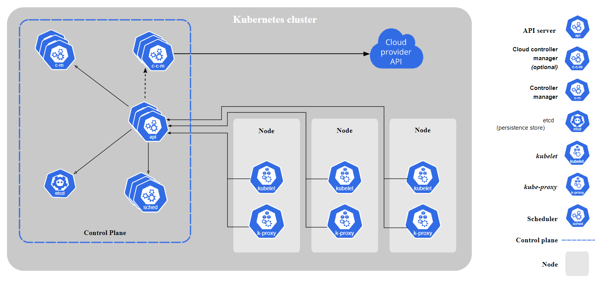
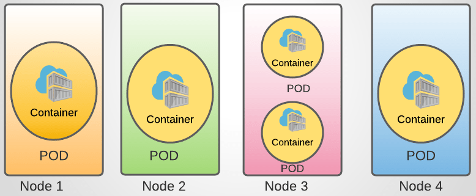

# kubernetes-ftw

*The purpose of this **unfinished** repository is to document my Kubernetes journey, and nerd-out!*

## To Do:
- [ ] Finish the Udemy CKA course
- [ ] Practice killer.sh Simulator

## Learning Material:
- [x] [Docker Certified Associate (A Cloud Guru)](https://learn.acloud.guru/course/6b00566d-6246-4ebe-8257-f98f989321cf/overview)
- [x] [Learn Kubernetes by Doing (A Cloud Guru)](https://learn.acloud.guru/course/82b39fac-b9f7-43d1-8f52-6a89efe5202f/dashboard)
- [ ] [Certified Kubernetes Administrator (CKA) with Practice Tests (Udemy)](https://www.udemy.com/course/certified-kubernetes-administrator-with-practice-tests/)
- [ ] [Killer Shell Simulator](https://killer.sh/)

## Lessons Learned:
- I completed the ACG Docker course to prepare me for diving into Kubernetes
- The Udemy course was hard to follow when I had zero hands-on experience
- After a few videos in, I pivoted to the ACG Learn Kubernetes by Doing course to get my hands dirty
- This was a great move!
- The Udemy course is a GREAT resource
- Exam_Note: Read if exam takers recommend using the `kubectl edit` command versus editing the YAML files directly
    - Udemy course, video 32 has related tips!
- Exam_Note: Learn the short form of commands [Example: `kubectl get <resource> <resource_name>`]
    - svc [service]
    - rs [replicaset]
    - rc [replicationcontroller]
    - ns [namespaces]
    - po [pod]
    - deploy [deployment]
- Exam_Note: SHORTCUTS
    - `-n=<namespace_name>` vs `--namespace=<namespace_name>`
    - `-A` vs `--all-namespaces`
- Exam_Notes:
    - Use Imperative commands to save time during the exam (video 43/44)
- Definition file examples can be found [here](https://kubernetes.io/docs/concepts/workloads/)
- Exam_Notes:
    - Run `kubectl <command> --help` and pipe to grep for examples
    - Example: `kubectl expose --help | grep "kubectl expose"`

## Useful commands:
- `kubectl --help` [Help documentation]
- `kubectl get pods` [List pods in default namespace, add `-o wide` for more details]
- `kubectl get all` [Get all resources]
- `kubectl run <pod_name> --image=<image_name> --dry-run=client -o yaml > file.yaml` [Create pod-definition]
- `kubectl run nginx --image=nginx` [Create nginx pod]
- `kubectl describe pod <pod_name>` [Get specific pod details]
- `kubectl delete pod <pod_name>` [Delete pod]
- `kubectl create -f FILENAME` [Create a resource from a file or from stdin]
- `kubectl create deployment my-dep --image=httpd:2.4-alpine --replicas=3` [Create deployment w/o a YAML file]
- `kubectl apply -f FILENAME` [Apply a config to a resource by file name or stdin]
- `kubectl scale ...` [Set a new size for a Deployment, RelicaSet, Replication Controller, or StatefulSet]
- `kubectl replace ...` [Replace a resource by filename or stdin]
- `kubectl edit ...` [Edit a resource from the default editor]
- `kubectl explain <resource> ...` [List the fileds for supported resources]

## Kubernetes Architecture: [LINK](https://kubernetes.io/docs/concepts/overview/components/)
- Control Plane:
    - ETCD: Highly-available key-value store used to store all cluster data
    - kube-apiserver: Exposes the Kubernetes API
    - kube Controller Manager: Runs controller processes "Node, Job, EndpointSlice, ServiceAccount"
    - kube-scheduler: Chooses which node to run a new Pod if its not already assigned
- Worker Node:
    - kubelet: An agent that runs on each node, ensuring the containers are running in a Pod
    - kube-proxy: Network proxy that runs on each node
    - Container Runtime Engine: Software responsible for running containers
- High Level architecture:

- Low Level architecture:
