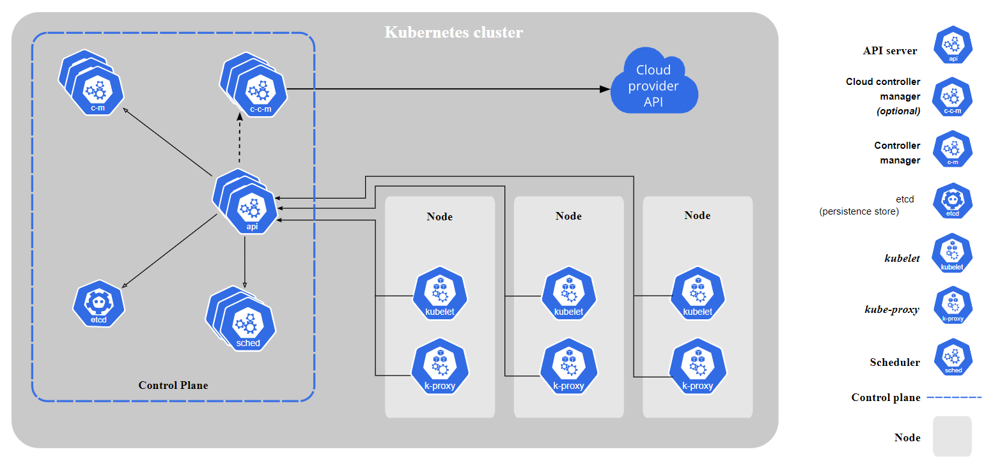
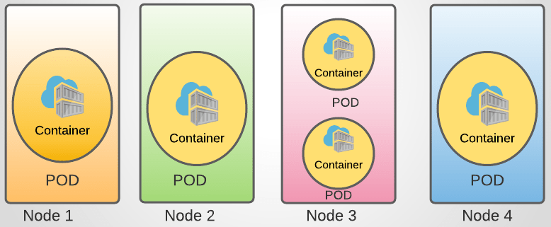

# kubernetes-ftw

*The purpose of this **unfinished** repository is to document my Kubernetes journey, and nerd-out!*

## Learning Material:
- [x] [Docker Certified Associate (A Cloud Guru)](https://learn.acloud.guru/course/6b00566d-6246-4ebe-8257-f98f989321cf/overview)
- [x] [Learn Kubernetes by Doing (A Cloud Guru)](https://learn.acloud.guru/course/82b39fac-b9f7-43d1-8f52-6a89efe5202f/dashboard)
- [ ] [Certified Kubernetes Administrator (CKA) with Practice Tests (Udemy)](https://www.udemy.com/course/certified-kubernetes-administrator-with-practice-tests/)
- [ ] [Killer Shell Simulator](https://killer.sh/)

## Notes Glossary:
- [00-tbd]()
- [00-core-concepts-manifest](notes/00-core-concepts-manifest-basics.md)
- [00-core-concepts-pod](notes/00-core-concepts-pod.md)
- [00-core-concepts-replicationcontroller](notes/00-core-concepts-replicationcontroller.md)
- [00-core-concepts-replicaset](notes/00-core-concepts-replicaset)
- [00-core-concepts-deployment](notes/00-core-concepts-deployment)
- [00-core-concepts-services](notes/00-core-concepts-services)
- [00-core-concepts-namespace](notes/00-core-concepts-namespace)
- [00-scheduling-resource-quota](notes/00-scheduling-resource-quota)
- [00-scheduling-manual](notes/00-scheduling-manual)
- [00-scheduling-labels-selectors](notes/00-scheduling-labels-selectors)
- [00-scheduling-taints-tolerations](notes/00-scheduling-taints-tolerations)
- [00-scheduling-node-affinity](notes/00-scheduling-node-affinity)
- [00-scheduling-resource-requests](notes/00-scheduling-resource-requests)
- [00-scheduling-resource-limits](notes/00-scheduling-resource-limits)
- [00-scheduling-daemonset](notes/00-scheduling-daemonset)
- [00-scheduling-schedulers](notes/00-scheduling-schedulers)
- [00-scheduling-static-pods](notes/00-scheduling-static-pods)
- [00-scheduling-multi-profile-scheduler](notes/00-scheduling-multi-profile-scheduler)
- [00-logging-monitoring](notes/00-logging-monitoring)
- [00-app-mgmt-deployment-strategy](notes/00-app-mgmt-deployment-strategy)
- [00-app-mgmt-env-vars](notes/00-app-mgmt-env-vars)
- [00-app-mgmt-commands-args](notes/00-app-mgmt-commands-args)
- 
- 
- 
- 
- 
- 
- 
- 
- 
- 
- 

# ==Application Lifecycle Management==

## Secrets:
- `kubectl ...`
## Multi Container PODs:
- `kubectl ...`
## Init Containers:
- `kubectl ...`
---

# ==Cluster Maintenance==
## OS Upgrades:
- `kubectl ...`
## Cluster Upgrade Process:
- `kubectl ...`
## Backup and Restore Methods:
- `kubectl ...`
## Backup and Restore Methods 2:
- `kubectl ...`
---

# ==Security==
## View Certificate Details:
- `kubectl ...`
## Certificates API:
- `kubectl ...`
## KubeConfig:
- `kubectl ...`
## Role BAsed Access Controls:
- `kubectl ...`
## Cluster Roles:
- `kubectl ...`
## Service Accounts:
- `kubectl ...`
## Image Security:
- `kubectl ...`
## Security Contexts:
- `kubectl ...`
## Network Policies:
- `kubectl ...`
---

# ==Storage==
## Persistent Volume Claims:
- `kubectl ...`
## storage Class:
- `kubectl ...`
---

# ==Networking==
## Explore Environment:
- `kubectl ...`
## CNI:
- `kubectl ...`
## Deploy Network Solution:
- `kubectl ...`
## Networking Weave:
- `kubectl ...`
## Service Networking:
- `kubectl ...`
## CoreDNS in Kubernetes:
- `kubectl ...`
## Ingress Networking - 1:
- `kubectl ...`
## Ingress Networking - 2:
- `kubectl ...`
---

# ==Install==
## cluster Installation using Kubeadm:
- `kubectl ...`
---

# ==Troubleshooting==
## Appliation Failure:
- `kubectl ...`
## Control Plane Failure:
- `kubectl ...`
## Worker Node Failure:
- `kubectl ...`
## Troubleshoot Network:
- `kubectl ...`
---

# ==Other Topics==
## JSON PATH:
- `kubectl ...`
## Advanced Kubectl Commands:
- `kubectl ...`
---

# ==Lighting Labs==
## Ligtning Lab - 1:
- `kubectl ...`
---

# ==Mock Exams==
## Mock Exam - 1:
- `kubectl ...`
## Mock Exam - 2:
- `kubectl ...`
## Mock Exam - 3:
- `kubectl ...`
## CKA Mock Exam - 2 Solution:
- `kubectl ...`
## CKA Mock Exam - 3 Solution:
- `kubectl ...`
---

## Lessons Learned:
- I completed the ACG Docker course to prepare me for diving into Kubernetes
- The Udemy course was hard to follow when I had zero hands-on experience
- After a few videos in, I pivoted to the ACG Learn Kubernetes by Doing course to get my hands dirty
- This was a great move!
- The Udemy course is a GREAT resource
- Definition file examples can be found [here](https://kubernetes.io/docs/concepts/workloads/)
- Switching Gears:
    - About 25% through the course I found I didn't properly record notes for definition files
    - This is super important as these definition files build on each other
    - I'm going to passively watch the rest of the course to get familiar with Kubernetes theory
    - I'll take the course again from begining to end while properly organizing my notes
    - "This Is The Way..."

## Exam Tips:
- Read if exam takers recommend using the `kubectl edit` command versus editing the YAML files directly
    - Udemy course, video 32 has related tips!
- Learn the short form of commands [Example: `kubectl get <resource> <resource_name>`]
    - svc [service]
    - rs [replicaset]
    - rc [replicationcontroller]
    - ns [namespaces]
    - po [pod]
    - deploy [deployment]
    - ds [daemonset]
    - sts [statefulset]
    - cj [cronjob]
- SHORTCUTS:
    - `-n=<namespace_name>` vs `--namespace=<namespace_name>`
    - `-A` vs `--all-namespaces`
- Use Imperative commands to save time during the exam (video 43/44)
- Run `kubectl <command> --help` and pipe to grep for examples
- Example: `kubectl expose --help | grep "kubectl expose"`
- Look into creating an alias for kubectl = k (This may already be on some systems?)
- Learn VIM quick commands, specifically around editing yaml files quickly
- A lot of tips are located in 1min "videos"
- If need to create a YAML for DaemonSet, create a YAML for a Deployment and vim the YAML
- If creating via Imperative:
    - `kubectl create <object> ..` THEN `kubectl edit <object> ..`
    - Use `kubectl replace ...` to replace a running pod using a pod defnintion file

## Useful commands:
- `kubectl --help` [Help documentation]
- `kubectl get pods` [List pods in default namespace, add `-o wide` for more details]
- `kubectl get all` [Get all resources]
- `kubectl run <pod_name> --image=<image_name> --dry-run=client -o yaml > file.yaml` [Create pod-definition file]
- `kubectl run nginx --image=nginx` [Create nginx pod]
- `kubectl describe pod <pod_name>` [Get specific pod details]
- `kubectl delete pod <pod_name>` [Delete pod]
- `kubectl create -f FILENAME` [Create a resource from a file or from stdin]
- `kubectl create deployment my-dep --image=httpd:2.4-alpine --replicas=3` [Create deployment w/o a YAML file]
- `kubectl create deploy deployment --image=nginx --dry-run=client -o yaml` [Create deployment-definition file]
- `kubectl apply -f FILENAME` [Apply a config to a resource by file name or stdin]
- `kubectl scale ...` [Set a new size for a Deployment, RelicaSet, Replication Controller, or StatefulSet]
- `kubectl replace ...` [Replace a resource by filename or stdin]
- `kubectl edit ...` [Edit a resource from the default editor]
- `kubectl explain <resource> ...` [List the fileds for supported resources]

## kubectl: Controls the Kubernetes cluster manager
- [Reference Docs](https://kubernetes.io/docs/reference/kubectl/)
- [Command Docs](https://kubernetes.io/docs/reference/generated/kubectl/kubectl-commands)
- [Official Cheat Sheet](https://kubernetes.io/docs/reference/kubectl/cheatsheet/)

## etcdctl: A simple command line client for etcd.
- [manpage](https://manpages.org/etcdctl)

## Kubernetes Architecture: [LINK](https://kubernetes.io/docs/concepts/overview/components/)
- Control Plane:
    - ETCD: Highly-available key-value store used to store all cluster data
    - kube-apiserver: Exposes the Kubernetes API
    - kube Controller Manager: Runs controller processes "Node, Job, EndpointSlice, ServiceAccount"
    - kube-scheduler: Chooses which node to run a new Pod if its not already assigned
- Worker Node:
    - kubelet: An agent that runs on each node, ensuring the containers are running in a Pod
    - kube-proxy: Network proxy that runs on each node
    - Container Runtime Engine: Software responsible for running containers
- K8s Architecture:

- Pod Architecture:
